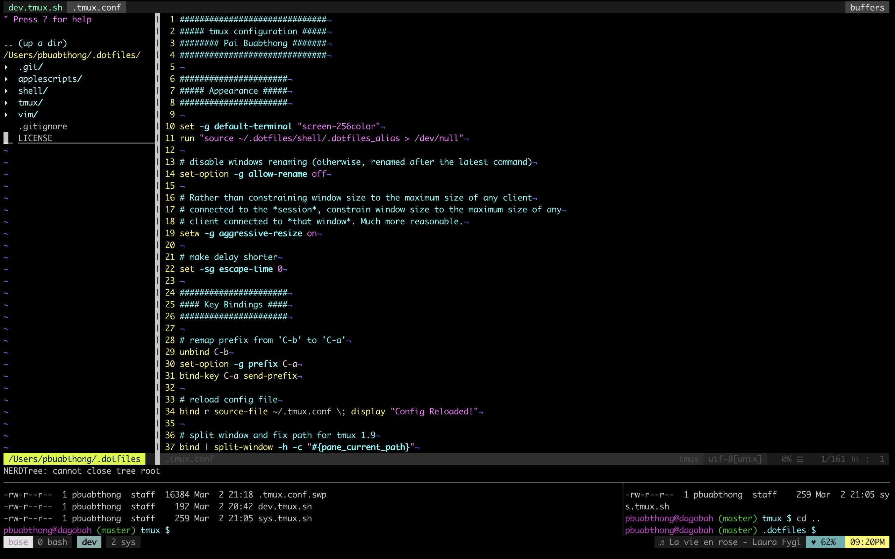
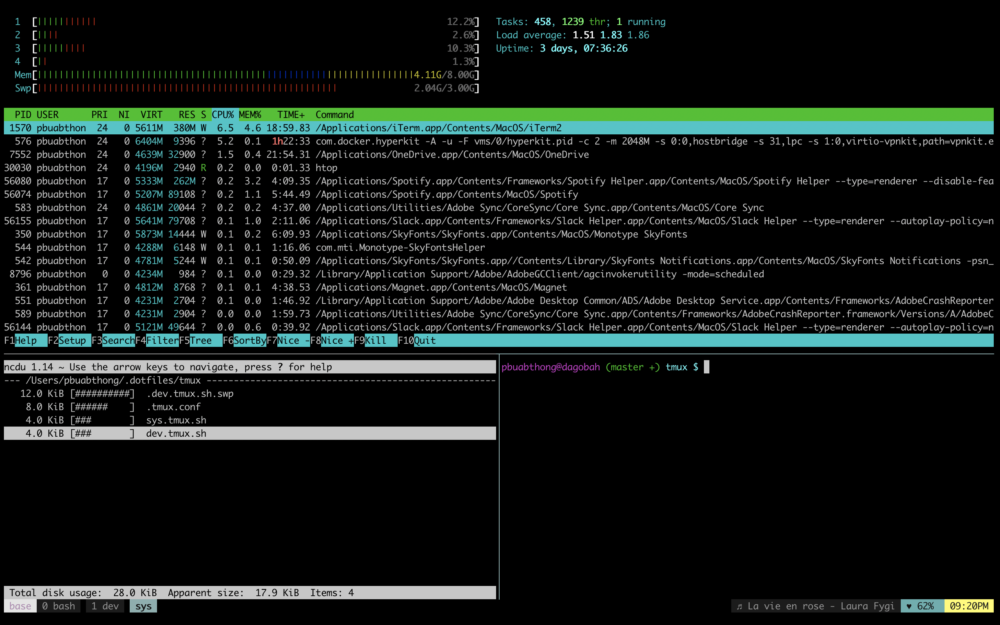

# .dotfiles

Here's a personal setup for my coding workflow using vim+tmux. Most of these configurations were inspired by a few other tmux/vim pros. I'd like to acknowledge a few online guides particularly, [Vim and Python - A Match Made in Heaven](https://realpython.com/vim-and-python-a-match-made-in-heaven/) for vim setup, [Making tmux Pretty and Usable](https://www.hamvocke.com/blog/a-guide-to-customizing-your-tmux-conf/) for basic tmux configurations, and [Nick Nisi' Vim + Tmux Talk](https://www.youtube.com/watch?v=5r6yzFEXajQ) for general layout designs. I'm mostly working with python and js. My main 'dev' layout consists of three panes where I would edit my codes on the top pane, run them on the second window, and navigate through the results with the last windows 



## Installation
First of all, let's make sure we have the most crucial requirements for these configurations to work: vim, tmux,
which can be installed via Homebrew if you are on macOS (or any package manager in most os'es)
```
brew install macvim
brew install tmux
```

### Vundle and TPM
I use [Vundle](https://github.com/VundleVim/Vundle.vim) for Vim plugin manager and [Tmux Plugin Manager](https://github.com/tmux-plugins/tpm) for plugin managers. Both can be easily installed by cloning their repository to home directory (if cloned to other location, change the rtp for Vundle in `.dotfile/vim/.vimrc` and run path in `.dotfiles/tmux/.tmux.conf`)

```
git clone https://github.com/VundleVim/Vundle.vim.git ~/.vim/bundle/Vundle.vim
git clone https://github.com/tmux-plugins/tpm ~/.tmux/plugins/tpm
```

### Configuration files
Instead of running tmux and vim with the path to a specific configuration (i.e. `tmux -f ~/.dotfiles/tmux/.tmux.conf`), we will create defaults configuration files in home directory that source our custom dotfiles.
We will also include the alias tmux-load for loading tmux script that automatically populates a new window with custom layout.
```
echo "so ~/.dotfiles/vim/.vimrc" >> ~/.vimrc
echo "source-file ~/.dotfiles/tmux/.tmux.conf" >> ~/.tmux.conf
echo "source ~/.dotfiles/shell/.dotfiles_alias" >> ~/.bash_profile
```

Then, install the plugins in vim with
```
vim +PluginInstall
```
and in tmux with
```
tmux
[prefix] + I
```

Now you're ready to go! 

## Usage
Here'a the summary of changes, mainly with keys map
* the typical tmux prefix `Ctrl-b` has been mapped to `Ctrl-a` 
* for navigating through panes (universal across vim and tmux), use `Ctrl-h`,`Ctrl-j`,`Ctrl-k`, and `Ctrl-l` (similar direclty as in vim)
* for navigation through different windows, use `Ctrl-a-h` and `Ctrl-a-l`
* the leader key has been mapped to `,`

### Custom layout
Within tmux, you can create a new window with customs layout defined in `.dotfiles/tmux/`. These are the files with extension .tmux.sh

```
tmux-load [layout]
```
For example, 
```
tmux-load dev
```

Currently, the following layouts are available
#### dev.tmux.sh

#### sys.tmux.sh


## macOS
As this configurations were written mostly for my Macbook Pro, in `.tmux.conf`, the right status bar would also include
* the current song and artist being played on spotify

if you want to use this for other system, consider commenting these parts out. Otherwise, there would be small ♫ and ♥ symbol as part of the status bar (though, it would not affect the functionality)
* the battery percentage of the laptop
